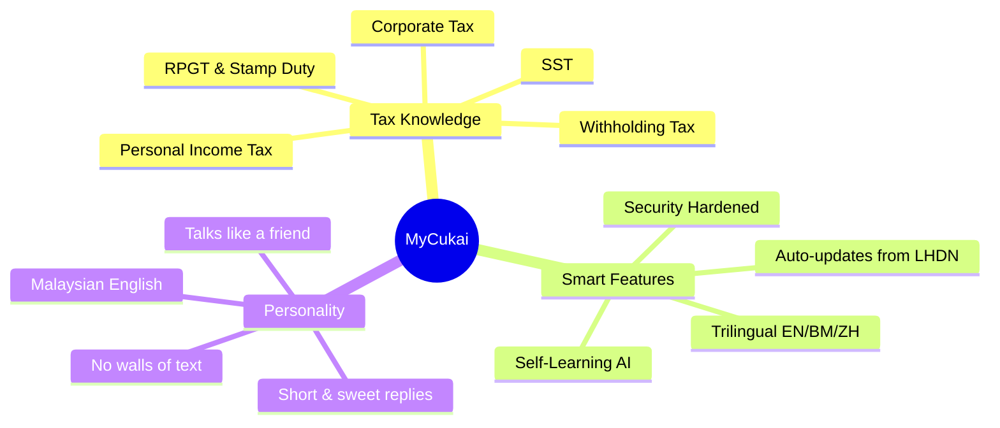
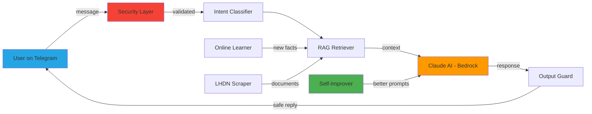
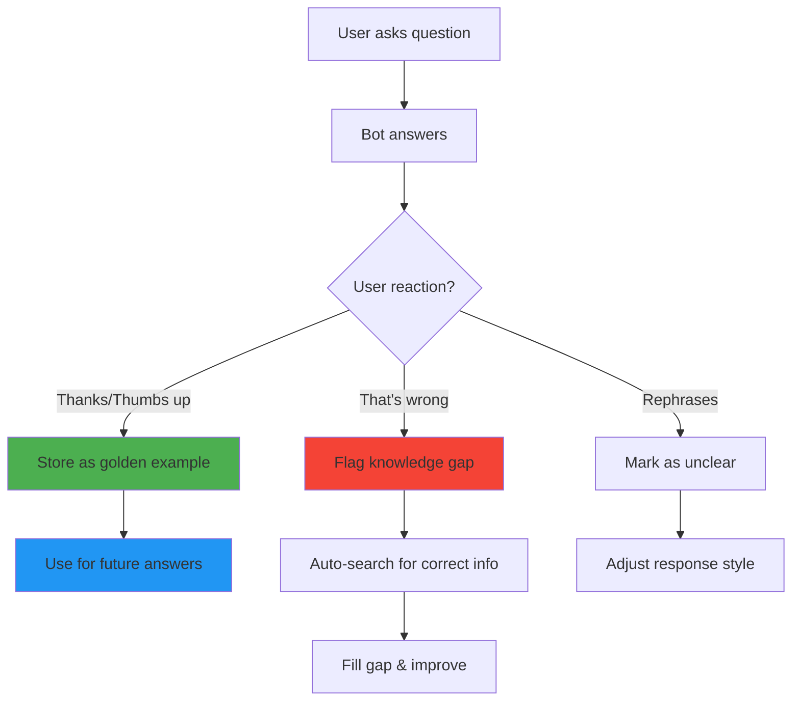

<p align="center">
  
</p>

<p align="center">
  
  
  
  
</p>

<p align="center">
  
</p>

---

## What is this?

**MyCukai** is an AI-powered tax assistant that talks like your smart Malaysian friend — not a boring government robot. Ask it anything about Malaysian tax and it'll explain simply in English, BM, or Chinese.

```
You:  "can i claim my laptop for tax?"
Bot:  "Yeah! Falls under lifestyle relief — up to RM 2,500 total 
       for gadgets, books, sports stuff, internet. Just keep the receipt ya."
```

<p align="center">
  <a href="https://t.me/Mycukai_TaxBot">
    
  </a>
</p>

---

## Features



| What it covers | How it feels |
|:---:|:---:|
| Income tax rates & reliefs | Like texting a smart friend |
| e-Filing & deadlines | Short answers, not essays |
| SST registration & rates | Malaysian English lah |
| RPGT on property sales | Empathetic & encouraging |
| Corporate tax & incentives | Code-switches naturally |
| Withholding tax & DTAs | Never judgmental |

---

## Tech Stack

<p align="center">
  
</p>

| Layer | Tech | What it does |
|:---:|---|---|
| Brain | Claude AI (AWS Bedrock) | Understands and answers questions |
| Memory | ChromaDB + Voyage AI | Finds relevant tax documents |
| Learning | Self-improving feedback loop | Gets smarter with every chat |
| Interface | Telegram Bot API | Where users chat |
| Security | 7-layer defense system | Blocks hackers & abuse |
| Pipeline | pdfplumber + BeautifulSoup | Scrapes LHDN documents |

---

## Quick Start

```bash
# Clone
git clone https://github.com/NyChieng/Tax_consult_Bot.git
cd Tax_consult_Bot

# Install
pip install -r requirements.txt

# Configure (add your API keys)
cp .env.example .env

# Run the bot
python run.py telegram
```

### All Commands

```bash
python run.py telegram    # Start Telegram bot
python run.py api         # Start REST API server
python run.py agent       # Start autonomous AI agent
python run.py pipeline    # Scrape → Process → Embed
python run.py content     # Generate marketing content
python run.py health      # System health check
python run.py test        # Run accuracy tests
```

---

## Architecture



---

## Self-Learning System

The bot gets **smarter every day** — no manual training needed.



---

## Security

7 layers protecting your bot from hackers:

| # | Layer | Blocks |
|---|---|---|
| 1 | Rate Limiter | DDoS, burst attacks |
| 2 | Input Guard | Prompt injection, XSS, SQL injection |
| 3 | Output Guard | API key leaks, PII exposure |
| 4 | Authentication | Unauthorized access |
| 5 | Encryption | Data at rest |
| 6 | Audit Log | Tamper-evident logging |
| 7 | Docker | Non-root, read-only filesystem |

---

## Environment Variables

```env
LLM_PROVIDER=bedrock              # or "anthropic"
AWS_ACCESS_KEY_ID=xxx             # Your AWS key
AWS_SECRET_ACCESS_KEY=xxx         # Your AWS secret
AWS_REGION=us-east-1              # Bedrock region
TELEGRAM_BOT_TOKEN=xxx            # From @BotFather (FREE)
```

---

## Contributing

PRs welcome! This bot helps Malaysians understand tax — the more brains on it, the better.

---

## Disclaimer

> This bot is an **educational reference tool** — not a licensed tax agent. It doesn't file returns, calculate your specific liability, or represent you before LHDN. For personal tax matters, consult a registered tax agent (Tax Agents Act 1995).

---

<p align="center">
  
</p>

<p align="center">
  <a href="https://t.me/Mycukai_TaxBot">Try MyCukai on Telegram</a> · 
  <a href="BUSINESS_STRATEGY.md">Business Strategy</a>
</p>
